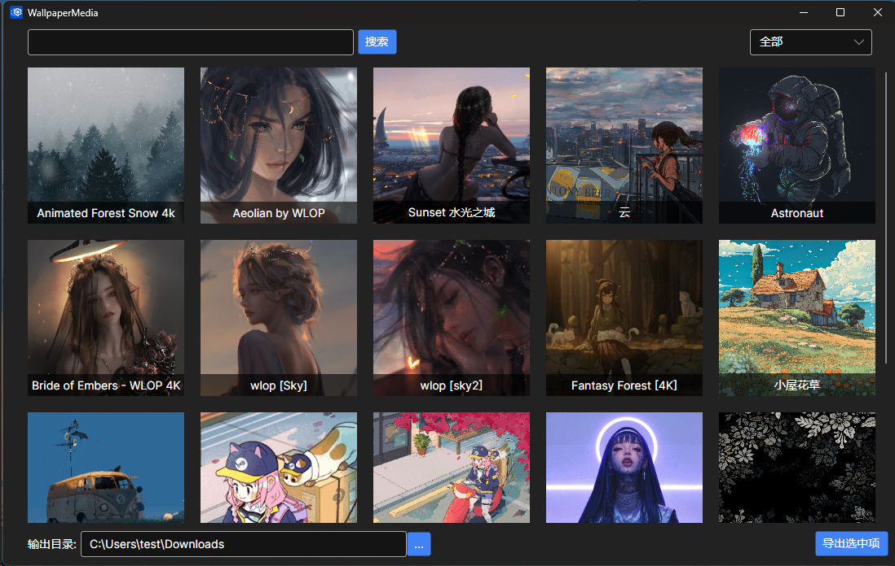

# WallpaperMedia

WallpaperMedia 是一个基于[RePKG](https://github.com/notscuffed/repkg)的开源项目，用于解包Wallpaper的壁纸文件。

该项目为不擅长命令行的同学提供了GUI图形化界面，方便操作查找

软件自动查找壁纸位置，打开即用无需配置任何东西

[下载地址](https://github.com/tangxiaoqi-tangxiao/WallpaperMedia/releases/tag/v1.0.0)